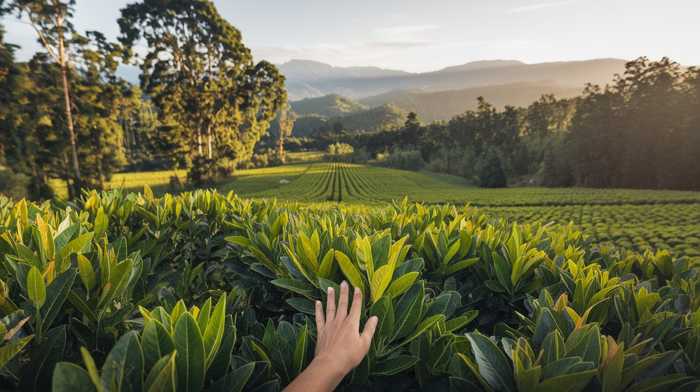
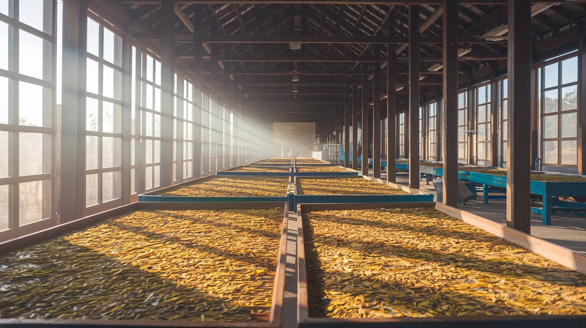

<html lang="es">
<head>
  <meta charset="UTF-8">
  <meta name="viewport" content="width=device-width, initial-scale=1.0">
  <title>Yerba Mate Mística</title>
  
</head>
<body>

  <!-- Encabezado -->
  <header>
    <h1>Yerba Mate Mística</h1>
    <nav>
      <ul>
        <li><a href="#introduccion">Introducción</a></li>
        <li><a href="#proceso">Proceso</a></li>
        <li><a href="#valores">Valores</a></li>
        <li><a href="#contacto">Contacto</a></li>
      </ul>
    </nav>
  </header>

  <!-- Sección 1: Introducción -->
  <section id="introduccion" class="intro">
    <h2>Bienvenidos a Yerba Mate Mística</h2>
    
Descubre la esencia de nuestra yerba mate, cultivada con amor y tradición.

    
  </section>

  <!-- Sección 2: Proceso -->
  <section id="proceso" class="process">
    <h2>Nuestro Proceso</h2>
    

      
      

        <h3>Materia Prima</h3>
        
Seleccionamos las mejores hojas de yerba mate de los cultivos locales.

      

    

    

      
      

        <h3>Secado de Hojas</h3>
        
Las hojas se secan al aire para resaltar su sabor natural y aroma.

      

    

    

      
      

        <h3>Molienda</h3>
        
Las hojas secas se muelen para obtener la textura perfecta para el consumo.

      

    

  </section>

  <!-- Sección 3: Valores -->
  <section id="valores" class="value-section">
    <h2>Nuestros Valores</h2>
    

      <h3>Calidad</h3>
      
Nos comprometemos a ofrecer la mejor calidad en cada taza de yerba mate.

    

    

      <h3>Sustentabilidad</h3>
      
Practicamos métodos de producción sostenibles que cuidan el medio ambiente.

    

    

      <h3>Tradición</h3>
      
Respetamos las tradiciones de la yerba mate, fusionando lo antiguo con lo moderno.

    

  </section>

  <!-- Sección 4: Contacto -->
  <section id="contacto" class="contact-section">
    <h2>Contáctanos</h2>
    <form>
      <input type="text" placeholder="Tu nombre" required>
      <input type="email" placeholder="Tu correo electrónico" required>
      <textarea placeholder="Tu mensaje" rows="4" required></textarea>
      <button type="submit">Enviar</button>
    </form>
  </section>

  <!-- Footer -->
  <footer>
    
&copy; 2024 Yerba Mate Mística. Todos los derechos reservados.

  </footer>

</body>
</html>
